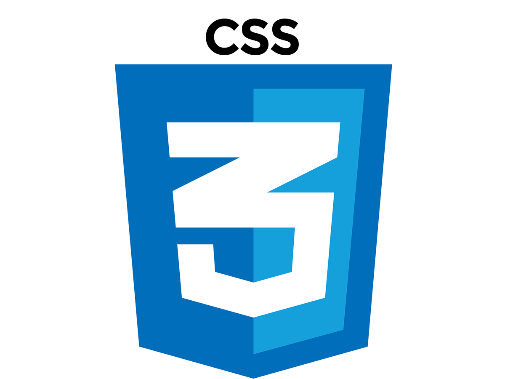
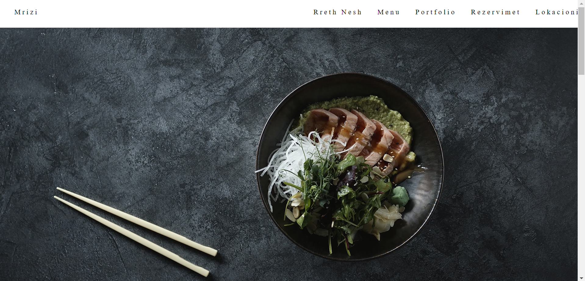
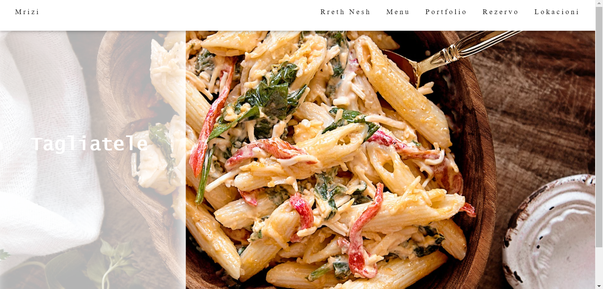

# Labproject
     

## Mrizi

### This is a web-based system for managing restaurant operations and customer reservations.

 ## Environment:

- Operating System: Windows 10
- Browser: Google Chrome, Internet Explorer, Mozilla Firefox, Safari
- Front-end: HTML , CSS, JavaScript
- Back-end: PHP

### Links

- [E-commerce using front](https://www.youtube.com/watch?v=18Jvyp60Vbg)
- [PHP Tutorials](https://www.w3schools.com/php/)
- [CRUD Application with PHP, PDO, and MySQL](https://codeshack.io/crud-application-php-pdo-mysql/)

### Screenshots
- Main ones :

    
